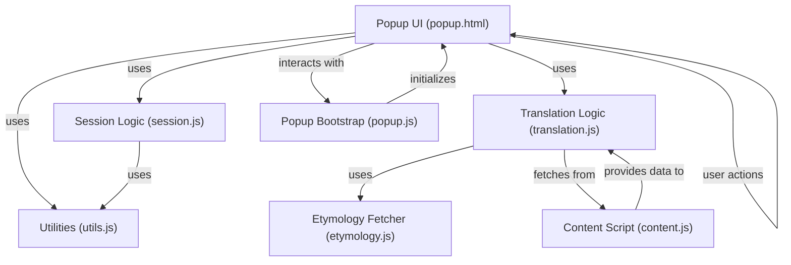
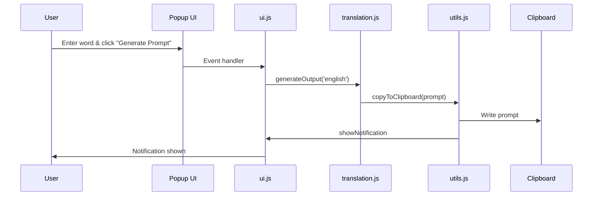
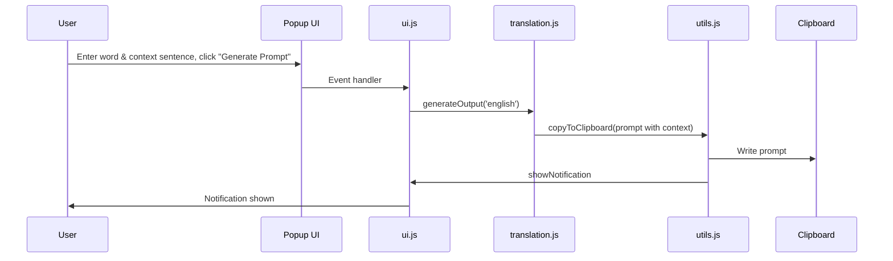
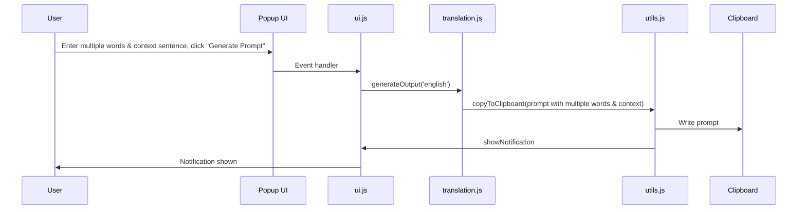
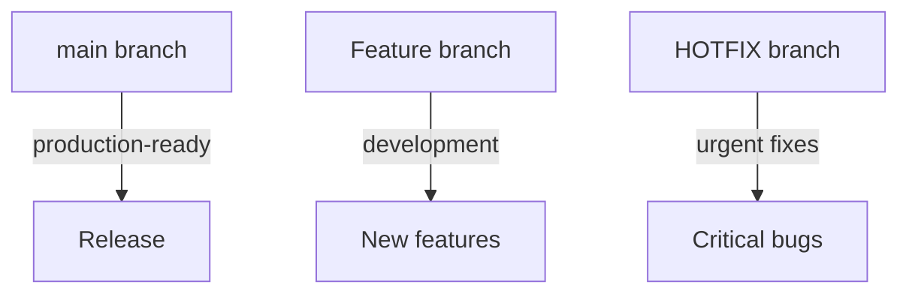
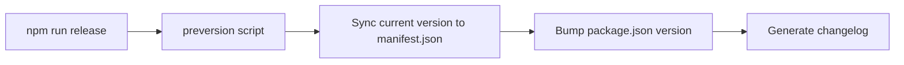
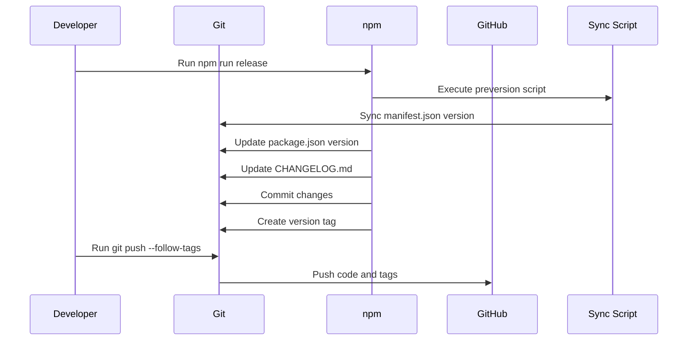

# scott-edge-extensions

## Table of Contents
- [Scenarios](#scenarios)
- [Loading into Edge](#loading-into-edge)
- [Development](#development)
- [Component Diagram](#component-diagram)
- [Sequence Diagrams](#sequence-diagrams)
- [Contributor Onboarding](#contributor-onboarding)

This extension is for interacting with [ChatGPT](https://openai.com/blog/chatgpt) for learning English. There are 3 scenarios supported so far.

## Scenarios
1. A single word
   > unenforceable
2. A single word with its context sentence
   > aloof  
   His ratings remain dismal, not least because of his cold, aloof manner and his eagerness to please the party.
3. Multiple words with its context sentence

## Loading into Edge
1. Type `edge://extensions`
2. Click the 'Reload' button

## Development
1. Make sure [Microsoft Edge DevTools extension](https://learn.microsoft.com/en-us/microsoft-edge/visual-studio-code/microsoft-edge-devtools-extension) is installed on VS code.
2. When devloping in VS Code, move to an HTML file, right click the file, and then choose 'Open with Edge' > 'Open Browser with DevTools'.

## Component Diagram



## Sequence Diagrams

### 1. Single Word


### 2. Single Word with Context Sentence


### 3. Multiple Words with Context Sentence


## Contributor Onboarding

### Branching Strategy


**Branch Types:**
- **main**: Stable, production-ready code
- **feature**: For developing new features
- **hotfix**: For critical bug fixes

**Feature Development Workflow:**
1. Create feature branch from main:
   ```bash
   git checkout main
   git pull origin main
   git checkout -b feat/your-feature-name
   ```
2. Develop and test changes
3. Commit changes using conventional commits:
   ```bash
   git add .
   npm run commit
   ```
4. Push branch to repository:
   ```bash
   git push origin feat/your-feature-name
   ```
5. Create pull request for review
6. Merge to main after approval

### Version Management
This project uses a unified versioning system where:
- `package.json` is the source of truth for the version
- The extension version in `english-helper/manifest.json` is automatically synchronized
- Version updates are managed through `standard-version`

### Development Workflow
1. Install dependencies:
   ```bash
   npm install
   ```
2. Make code changes
3. Stage changes:
   ```bash
   git add .
   ```
4. Commit changes using conventional commit format:
   ```bash
   npm run commit
   ```

### Release Process
1. Run the release command to:
   - Automatically synchronize manifest.json version from package.json
   - Update `package.json` version based on commit types
   - Generate/update `CHANGELOG.md`
   - Commit version changes
   - Create git tag
   ```bash
   npm run release
   ```
2. Push changes and tags to repository:
   ```bash
   git push --follow-tags
   ```

### Important Note About Version Sync Timing


This means:
1. The sync script runs BEFORE version bump
2. manifest.json gets the current version (before bump)
3. package.json gets bumped to the new version
4. This ensures manifest.json always matches the version that was just released


