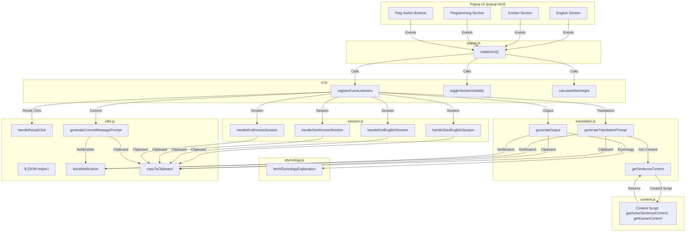
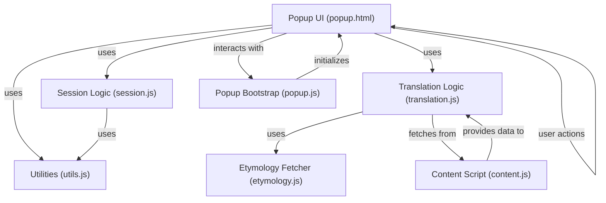
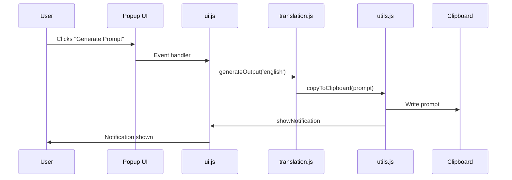

# scott-edge-extensions
This extension is for interacting with [ChatGPT](https://openai.com/blog/chatgpt) for learning English. There are 3 scenarios supported so far.

## Scenarios
1. A single word
   > unenforceable
2. A single word with its context sentence
   > aloof  
   His ratings remain dismal, not least because of his cold, aloof manner and his eagerness to please the party.
3. Multiple words with its context sentence

## Loading into Edge
1. Type `edge://extensions`
2. Click the 'Reload' button

## Development
1. Make sure [Microsoft Edge DevTools extension](https://learn.microsoft.com/en-us/microsoft-edge/visual-studio-code/microsoft-edge-devtools-extension) is installed on VS code.
2. When devloping in VS Code, move to an HTML file, right click the file, and then choose 'Open with Edge' > 'Open Browser with DevTools'.

## Architecture Diagram

## Component Diagram

## Sequence Diagram (User Generates English Prompt)

