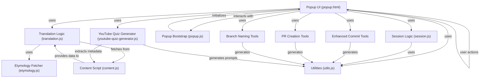
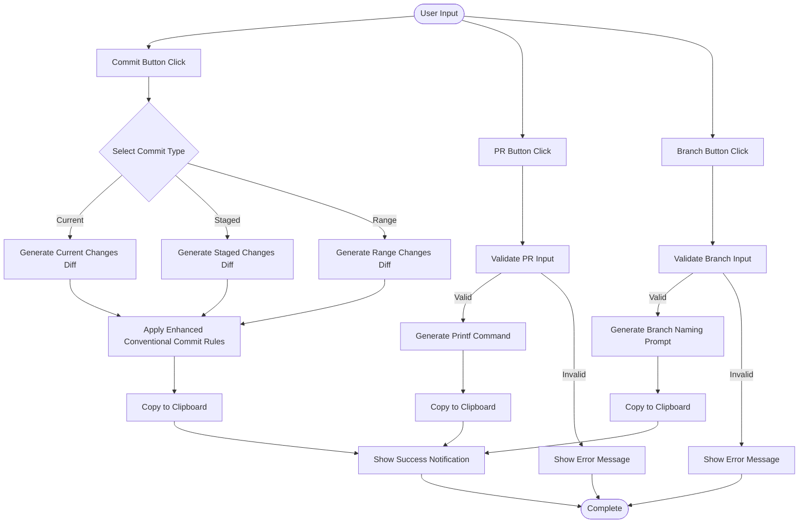
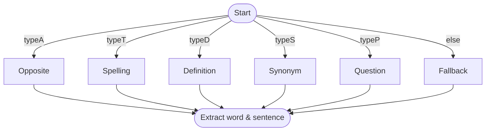
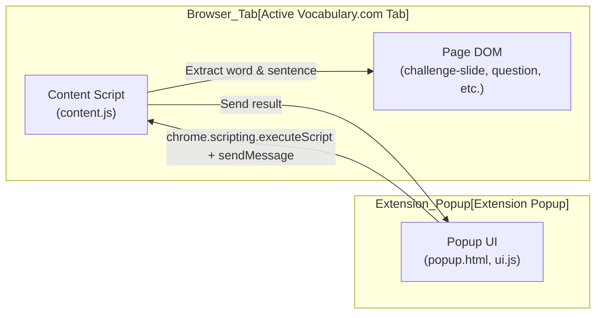
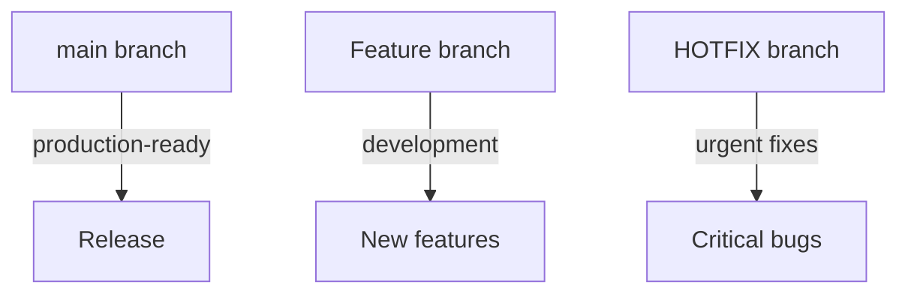

# Scott's Assistant for Language Learning and Programming

This browser extension provides comprehensive assistance for language learners (English and Korean) and programmers. It extracts vocabulary questions and context from Vocabulary.com, generates optimized LLM prompts for language learning, and provides programming tools for commit message generation and pull request creation.

## Table of Contents
- [Features Overview](#features-overview)
- [Technical Documentation](#technical-documentation)
- [UI Features](#ui-features)
- [Architecture](#architecture)
  - [Component Diagram](#component-diagram)
  - [Programming Tools Workflow](#programming-tools-workflow)
  - [Language Learning Extraction Logic](#language-learning-extraction-logic)
  - [Component Architecture Diagram](#component-architecture-diagram)
- [Development & Contribution](#development--contribution)
  - [Loading into Edge](#loading-into-edge)
  - [Development](#development)
  - [Contributor Onboarding](#contributor-onboarding)
  - [Modular CSS & UI Consistency](#modular-css--ui-consistency)
  - [Linting & Code Quality](#linting--code-quality)
- [Limitations & Notifications](#limitations--notifications)
- [Lessons Learned](#lessons-learned)

---

## Features Overview

See the detailed documentation available in our `docs/` folder for specific workflows and use-cases:

- [**Language Learning & Video Content**](docs/language-and-video.md): Vocabulary.com extraction, Etymonline fetching, and YouTube video AI quiz generation.
- [**Programming & Engineering Workflows**](docs/programming-features.md): Automatic Conventional Commit statements, Pull Request scaffolders, and automated branch naming via `git diff` analyses.
- **Infographic Design Engine**: Generate professional prompts natively in 9 styles with automatic visual previews and language translations.
- **Gemini & NotebookLM Image Polisher**: Smartly strip away AI watermarks and overlay your own custom signatures using client-side pixel manipulation operations.

---

## UI Features
- **Three-Tab Interface**: Organized into Language, Video, and Programming Engineering (PE) tabs for better feature separation (plus dedicated Infographic tool)
- **Infographic Generator**: Specialized interface for creating professional design prompts with visual style previews
- **YouTube Quiz Generator**: Dedicated functionality in the Video tab for creating educational quiz content from YouTube videos
- **Theme Toggle**: Switch between light and dark modes using the sun/moon icon in the top-right corner
- **Persistent Preferences**: Your theme preference is saved between sessions
- **Multi-language Support**: Dedicated sections for English and Korean learning in the Language tab
- **Programming Tools**: Comprehensive development tools in the PE tab including commit analysis, PR creation, and branch naming
- **Video Extraction**: Dedicated Video tab for extracting questions from DeepSRT challenge pages and generating YouTube quiz content
- **Auto-resize Textareas**: Dynamic sizing for better content input (up to 300px max height)
- **Consistent Notifications**: Clear success/error feedback across all features
- **Accessibility**: Proper ARIA labels and keyboard navigation support

---

## Architecture

### Component Diagram



### Programming Tools Workflow



### Language Learning Extraction Logic



### Component Architecture Diagram



### Scenario Table

| Type   | Word Source                | Sentence Source/Format                                 |
|--------|---------------------------|--------------------------------------------------------|
| typeA  | .instructions strong      | Instructions text + choices + explanation              |
| typeT  | .correctspelling or <strong> in .sentence.complete/.blanked | .sentence.complete or .sentence.blanked                |
| typeD  | <strong> in .instructions | "What does [word] mean?" + choices                    |
| typeS  | <strong> in .instructions | "[word] has the same or almost the same meaning as:" + choices + explanation |
| typeP  | <strong> in .sentence     | Question text + choices                                |
| else   | <strong> in .sentence     | .sentence                                              |

<!-- ... -->

## Gemini Image Polisher

A client-side tool to manipulate watermarks on images.

### Features
- **Smart Detection**: Uses **Pearson Correlation** to statistically verify the presence of a watermark before processing, ensuring clean images are never damaged.
- **Watermark Removal**: Uses advanced reverse alpha blending to remove Google Gemini generated watermarks.
- **Watermark Addition**: Adds a customizable "signature" watermark with Traditional Chinese date and calligraphy font.
    - **Customizable**: Adjust opacity, color, angle, size, and stroke.
    - **Real-time Preview**: See changes instantly as you adjust sliders.
- **Privacy Focused**: 100% client-side processing.

## Technical Documentation

- [Gemini Watermark Removal Logic](docs/gemini-watermark-removal.md)
- [NotebookLM Watermark Removal Logic](docs/notebooklm-watermark-removal.md)
- [Watermark Addition & Font Handling](docs/watermark-addition.md)
- [UI Resolution: Marquee Text Cutoff](docs/marquee_fix.md)


## Development & Contribution

### Loading into Edge
1. Type `edge://extensions`
2. Click the 'Reload' button

### Development
1. Make sure [Microsoft Edge DevTools extension](https://learn.microsoft.com/en-us/microsoft-edge/visual-studio-code/microsoft-edge-devtools-extension) is installed on VS code.
2. When developing in VS Code, move to an HTML file, right click the file, and then choose 'Open with Edge' > 'Open Browser with DevTools'.

#### Current Architecture
- **Main extension files**: Located in `asking-expert/` directory
- **Popup interface**: `popup.html`, `popup.js` (main bootstrap)
- **Content scripts**: `content.js` (page interaction)
- **Modular components**: Organized into feature-based modules:
  - **Video Module** (`modules/video/`): `video-extractor.js`, `youtube-quiz-generator.js`
  - **Language Module** (`modules/language/`): `translation.js`, `session.js`, `etymology.js`
  - **Core Module** (`modules/core/`): `ui.js`, `utils.js`, `content.js`
  - **Watermark Module** (`modules/watermark/`): `watermarkEngine.js`, `blendModes.js`, `alphaMap.js`
- **Styling**: Modular CSS files in `asking-expert/styles/` directory
- **Programming tools**: Integrated commit, PR, and branch naming functionality
- **YouTube tools**: Quiz generator for educational content creation

#### Module Organization

The JavaScript codebase is organized into feature-based modules for better maintainability:

```
asking-expert/
├── modules/
│   ├── video/           # Video-related functionality
│   ├── language/        # Language learning functionality
│   ├── watermark/       # Watermark removal logic
│   └── core/            # Core utilities and UI
├── popup.js (main entry point)
├── popup.html
├── manifest.json
├── images/
└── styles/
```

### Contributor Onboarding

#### Branching Strategy


**Feature Development Workflow:**
1. Create feature branch from main.
2. Develop and test changes.
3. Review and update `README.md` and `lesson_learned.md`.
4. Stage and commit changes.
5. Push branch and create PR.

#### Development Workflow
1. `npm install`
2. Make code changes.
3. `git add .`
4. `git commit -m "your message"`

#### Release Process
1. `npm run release`
2. `node scripts/sync-version.js`
3. `git add asking-expert/manifest.json`
4. `git commit --amend --no-edit`
5. `git tag -f vX.X.X`
6. `git push --follow-tags origin <branch-name>`

### Modular CSS & UI Consistency

- Use `gap` for flexbox spacing.
- Use `em` units for scaling spacing.
- Control overall popup spacing with `body { padding: ... }`.

### Linting & Code Quality

- **HTML:** `npx htmlhint`
- **CSS:** `npx stylelint "**/*.css"`

## Limitations & Notifications

- **Restricted Pages:** Cannot run on `chrome://` or `edge://` pages.
- **Notification UX:** Notifications fade out after 2 seconds.

## Lessons Learned

See [`lesson_learned.md`](lesson_learned.md) for implementation strategies and key takeaways.
