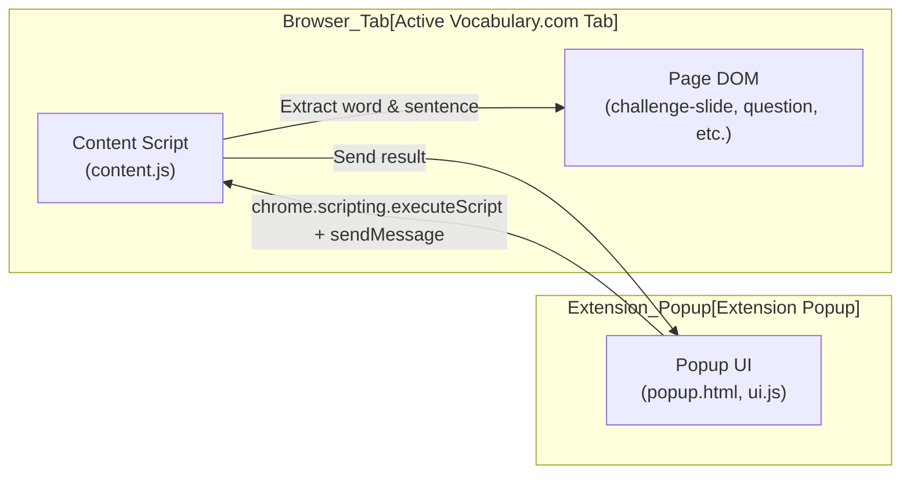

# Vocabulary.com Chrome Extension

This extension helps you extract vocabulary questions and context from Vocabulary.com and generate prompts for language learning and programming.

## Table of Contents
- [Supported Scenarios](#supported-scenarios)
- [Extraction Logic Flowchart](#extraction-logic-flowchart)
- [Component Architecture Diagram](#component-architecture-diagram)
- [Scenario Table](#scenario-table)
- [How It Works](#how-it-works)
- [Lessons Learned](#lessons-learned)

## Supported Scenarios

### 1. Standard Multiple-Choice (Context Sentence)
- **Word:** Extracted from `<strong>` in `.sentence`.
- **Sentence:** The full context sentence.

### 2. Definition-Style Multiple-Choice
- **Word:** Extracted from `<strong>` in `.instructions`.
- **Sentence:** Formatted as:
  ```
  What does [word] mean?
  1A [choice 1]
  2B [choice 2]
  ...
  ```

### 3. Synonym-Style Multiple-Choice
- **Word:** Extracted from `<strong>` in `.instructions`.
- **Sentence:** Formatted as:
  ```
  [word] has the same or almost the same meaning as:
  1A [choice 1]
  2B [choice 2]
  ...
  Please explain with the 2 words
  ```

### 4. Spelling Questions
- **Word:** Extracted from `.correctspelling` if available, otherwise from `<strong>` in `.sentence.complete` or `.sentence.blanked`.
- **Sentence:** The full sentence from `.sentence.complete` or `.sentence.blanked`.

### 5. Question-Style Multiple-Choice
- **Word:** Extracted from `<strong>` in `.sentence` in `.questionContent`.
- **Sentence:** The question text followed by the formatted choices.

### 6. Opposite-Style Multiple-Choice
- **Word:** Extracted from `<strong>` in `.instructions`.
- **Sentence:** The instructions text, followed by the choices, and ending with an explanation prompt.

### 7. Manual Entry
- If the "Word" field is filled manually, "Generate Prompt" will always generate and copy the prompt, regardless of page parsing.

---

## Extraction Logic Flowchart


---

## Component Architecture Diagram



---

## Scenario Table

| Type   | Word Source                | Sentence Source/Format                                 |
|--------|---------------------------|--------------------------------------------------------|
| typeA  | .instructions strong      | Instructions text + choices + explanation              |
| typeT  | .correctspelling or <strong> in .sentence.complete/.blanked | .sentence.complete or .sentence.blanked                |
| typeD  | <strong> in .instructions | "What does [word] mean?" + choices                    |
| typeS  | <strong> in .instructions | "[word] has the same or almost the same meaning as:" + choices + explanation |
| typeP  | <strong> in .sentence     | Question text + choices                                |
| else   | <strong> in .sentence     | .sentence                                              |

---

## How It Works

- The extension always targets the currently visible `.challenge-slide.selected` for extraction.
- The popup event handler ensures that prompt generation is robust: it tries to parse the page if fields are empty, but always allows manual entry as a fallback.
- Notifications are shown if parsing fails, guiding the user to enter missing content.

## Lessons Learned

- See `lesson_learned.md` for a detailed summary of implementation strategies and key takeaways.

---

This extension is robust, user-friendly, and supports a wide range of question types on Vocabulary.com.
